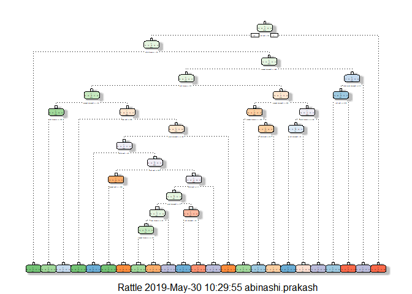

Executive Summary
-----------------

### Background

Using devices such as Jawbone Up, Nike FuelBand, and Fitbit it is now
possible to collect a large amount of data about personal activity
relatively inexpensively. These type of devices are part of the
quantified self movement - a group of enthusiasts who take measurements
about themselves regularly to improve their health, to find patterns in
their behavior, or because they are tech geeks. One thing that people
regularly do is quantify how much of a particular activity they do, but
they rarely quantify how well they do it. The goal of this project is to
use data from accelerometers on the belt, forearm, arm, and dumbbell of
6 participants as they perform barbell lifts correctly and incorrectly 5
different ways.

Six young healthy participants were asked to perform one set of 10
repetitions of the Unilateral Dumbbell Biceps Curl in five different
fashions: \* Class A - exactly according to the specification \* Class B
- throwing the elbows to the front \* Class C - lifting the dumbbell
only halfway \* Class D - lowering the dumbbell only halfway \* Class E
- throwing the hips to the front

### Data

The training data for this project are available at:

<https://d396qusza40orc.cloudfront.net/predmachlearn/pml-training.csv>

The test data are available at:

<https://d396qusza40orc.cloudfront.net/predmachlearn/pml-testing.csv>

The data for this project come from this source:
<http://web.archive.org/web/20161224072740/http:/groupware.les.inf.puc-rio.br/har>.

### GOAL

The goal of your project is to predict the manner in which they did the
exercise. This is the "classe" variable in the training set. You may use
any of the other variables to predict with. You should create a report
describing how you built your model, how you used cross validation, what
you think the expected out of sample error is, and why you made the
choices you did. You will also use your prediction model to predict 20
different test cases.

### Function and Data Download

    library(caret)

    ## Warning: package 'caret' was built under R version 3.5.3

    ## Loading required package: lattice

    ## Loading required package: ggplot2

    library(rpart)
    library(rpart.plot)

    ## Warning: package 'rpart.plot' was built under R version 3.5.3

    library(RColorBrewer)
    library(rattle)

    ## Warning: package 'rattle' was built under R version 3.5.3

    ## Rattle: A free graphical interface for data science with R.
    ## Version 5.2.0 Copyright (c) 2006-2018 Togaware Pty Ltd.
    ## Type 'rattle()' to shake, rattle, and roll your data.

    library(e1071)

    ## Warning: package 'e1071' was built under R version 3.5.3

    library(randomForest)

    ## Warning: package 'randomForest' was built under R version 3.5.3

    ## randomForest 4.6-14

    ## Type rfNews() to see new features/changes/bug fixes.

    ## 
    ## Attaching package: 'randomForest'

    ## The following object is masked from 'package:rattle':
    ## 
    ##     importance

    ## The following object is masked from 'package:ggplot2':
    ## 
    ##     margin

    set.seed(1)

    train.url <-
            "https://d396qusza40orc.cloudfront.net/predmachlearn/pml-training.csv"
    test.url <- 
            "https://d396qusza40orc.cloudfront.net/predmachlearn/pml-testing.csv"

    path <- paste(getwd(), sep="")
    train.file <- file.path(path, "machine-train-data.csv")
    test.file <- file.path(path, "machine-test-data.csv")

    if (!file.exists(train.file)) {
            download.file(train.url, destfile=train.file)
    }
    if (!file.exists(test.file)) {
            download.file(test.url, destfile=test.file)
    }

    train.data.raw <- read.csv(train.file, na.strings=c("NA","#DIV/0!",""))
    test.data.raw <- read.csv(test.file, na.strings=c("NA","#DIV/0!",""))

### Remove unecessary colums

    # Drop the first 7 columns as they're unnecessary for predicting.
    train.data <- train.data.raw[,8:length(colnames(train.data.raw))]
    test.data <- test.data.raw[,8:length(colnames(test.data.raw))]

    # Drop colums with NAs
    train.data <- train.data[, colSums(is.na(train.data)) == 0] 
    test.data <- test.data[, colSums(is.na(test.data)) == 0] 

    # Check for near zero variance predictors and drop them if necessary
    nzv <- nearZeroVar(train.data,saveMetrics=TRUE)
    zero.var.ind <- sum(nzv$nzv)

    if ((zero.var.ind>0)) {
            train.data <- train.data[,nzv$nzv==FALSE]
    }

### Slice the data for cross validation

The training data is divided into two sets. This first is a training set
with 70% of the data which is used to train the model. The second is a
validation set used to assess model performance.

    in.training <- createDataPartition(train.data$classe, p=0.70, list=F)
    train.data.final <- train.data[in.training, ]
    validate.data.final <- train.data[-in.training, ]

Model Development
-----------------

Train the model
---------------

The training data-set is used to fit a Random Forest model. A Random
Forest algorithm is a way of averaging multiple deep decision trees,
trained on different parts of the same data-set, with the goal of
reducing the variance. This typically produces better performance at the
expense of bias and interpret-ability. The Cross-validation technique
assesses how the results of a statistical analysis will generalize to an
independent data set. In 5-fold cross-validation, the original sample is
randomly partitioned into 5 equal sized sub-samples. a single sample is
retained for validation and the other sub-samples are used as training
data. The process is repeated 5 times and the results from the folds are
averaged.

    control.parms <- trainControl(method="cv", 5)
    rf.model <- train(classe ~ ., data=train.data.final, method="rf",trControl=control.parms, ntree=251)
    rf.model

    ## Random Forest 
    ## 
    ## 13737 samples
    ##    52 predictor
    ##     5 classes: 'A', 'B', 'C', 'D', 'E' 
    ## 
    ## No pre-processing
    ## Resampling: Cross-Validated (5 fold) 
    ## Summary of sample sizes: 10990, 10990, 10989, 10990, 10989 
    ## Resampling results across tuning parameters:
    ## 
    ##   mtry  Accuracy   Kappa    
    ##    2    0.9907547  0.9883044
    ##   27    0.9909733  0.9885816
    ##   52    0.9820921  0.9773451
    ## 
    ## Accuracy was used to select the optimal model using the largest value.
    ## The final value used for the model was mtry = 27.

### Estimate performance

    rf.predict <- predict(rf.model, validate.data.final)
    confusionMatrix(validate.data.final$classe, rf.predict)

    ## Confusion Matrix and Statistics
    ## 
    ##           Reference
    ## Prediction    A    B    C    D    E
    ##          A 1669    2    2    0    1
    ##          B    6 1130    2    1    0
    ##          C    0    4 1019    3    0
    ##          D    0    0    4  958    2
    ##          E    0    2    1    3 1076
    ## 
    ## Overall Statistics
    ##                                           
    ##                Accuracy : 0.9944          
    ##                  95% CI : (0.9921, 0.9961)
    ##     No Information Rate : 0.2846          
    ##     P-Value [Acc > NIR] : < 2.2e-16       
    ##                                           
    ##                   Kappa : 0.9929          
    ##                                           
    ##  Mcnemar's Test P-Value : NA              
    ## 
    ## Statistics by Class:
    ## 
    ##                      Class: A Class: B Class: C Class: D Class: E
    ## Sensitivity            0.9964   0.9930   0.9912   0.9927   0.9972
    ## Specificity            0.9988   0.9981   0.9986   0.9988   0.9988
    ## Pos Pred Value         0.9970   0.9921   0.9932   0.9938   0.9945
    ## Neg Pred Value         0.9986   0.9983   0.9981   0.9986   0.9994
    ## Prevalence             0.2846   0.1934   0.1747   0.1640   0.1833
    ## Detection Rate         0.2836   0.1920   0.1732   0.1628   0.1828
    ## Detection Prevalence   0.2845   0.1935   0.1743   0.1638   0.1839
    ## Balanced Accuracy      0.9976   0.9955   0.9949   0.9958   0.9980

    accuracy <- postResample(rf.predict, validate.data.final$classe)
    acc.out <- accuracy[1]

    overall.ose <- 
            1 - as.numeric(confusionMatrix(validate.data.final$classe, rf.predict)
                           $overall[1])

### Run the model

    results <- predict(rf.model, 
                       test.data[, -length(names(test.data))])
    results

    ##  [1] B A B A A E D B A A B C B A E E A B B B
    ## Levels: A B C D E

    ##Decision Tree
    treeModel <- rpart(classe ~ ., data=train.data.final, method="class")
    fancyRpartPlot(treeModel)

    ## Warning: labs do not fit even at cex 0.15, there may be some overplotting

